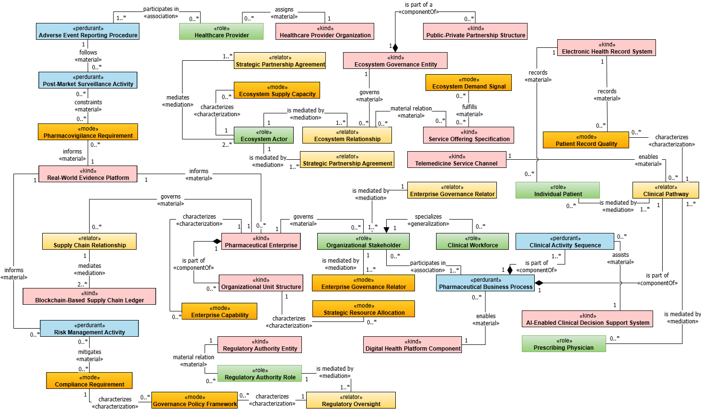

# CM-PharmE

**CM-PharmE** is an evolving, versioned, ontology-grounded conceptual model and research knowledge base for the pharmaceutical ecosystem. The repository is organized as a long-lived research asset supporting conceptual modeling, ontology engineering, evaluation, data mapping, publication traceability, and future applications.

> **Current stable semantic baseline:** `v1.0.0`  
> Ongoing development is managed through versioned branches and pull requests.  
> A manuscript revision does **not** automatically create a new CM-PharmE model version. A new model release is declared only when semantic changes to concepts, relations, domains, mappings, or ontology commitments are explicitly identified and versioned.

## Authors and Affiliations

1. **Araz Saie Arasi**  
   Department of Computer Engineering, Ra.C., Islamic Azad University, Rasht, Iran  
   [ORCID: 0009-0009-6739-5717](https://orcid.org/0009-0009-6739-5717)

2. **Hassan Haghighi**  
   Department of Software and Information Systems, Faculty of Computer Science and Engineering, Shahid Beheshti University, Tehran, Iran  
   [ORCID: 0000-0002-6145-4095](https://orcid.org/0000-0002-6145-4095)

3. **Hossein Azgomi**  
   Department of Computer Engineering, Ra.C., Islamic Azad University, Rasht, Iran  
   [ORCID: 0000-0001-7974-1845](https://orcid.org/0000-0001-7974-1845)

## Overview

Pharmaceutical ecosystems involve multi-layered interactions across organizational, regulatory, clinical, technological, and inter-organizational concerns. CM-PharmE provides a coherent conceptual foundation for representing those elements and their relationships with explicit ontological grounding. The initial model was developed with a business-architecture perspective and grounded in the Unified Foundational Ontology (UFO). The repository separates the conceptual model, formal ontology, release history, evaluation evidence, mappings, publications, and future applications so that research releases can be reproduced and compared over time.

## Model at a Glance — v1.0.0

| Item | Count |
|---|---:|
| Canonical concepts | **39** |
| Canonical semantic relations | **40** |
| Architectural domains | **5** |
| Concept stereotype families | **5** |
| Relation categories | **6** |

Concept stereotypes: 13 `kind`, 8 `mode`, 7 `role`, 6 `relator`, and 5 `perdurant`. The normalized documentation is derived primarily from the original Draw.io/XML source while preserving the historical OWL export for reproducibility and cross-checking.

[Full v1.0.0 statistics and structural audit](docs/evaluations/v1.0.0-structural-audit.md)

## Model Snapshot — v1.0.0

A domain-oriented view is also preserved in the historical release: [Domains of CM-PharmE v1.0.0](releases/v1.0.0/model/Domains-of-CM-PharmE-1.0.png).

## Explore CM-PharmE

| Area | Purpose |
|---|---|
| [Concepts](docs/concepts/index.md) | Canonical registry and one page per concept, with stable IDs, stereotypes, domains, relation traceability, and historical OWL snippets |
| [Relations](docs/relations/index.md) | Canonical relation registry and one page per relation, including source/target and semantic relation category |
| [Domains](docs/domains/index.md) | Five-domain architecture, domain scope, membership, and cross-domain mapping |
| [Versions](docs/versions/index.md) | Stable releases, semantic inventories, and unreleased engineering work |
| [Ontology](ontology/README.md) | Historical ontology provenance plus the unreleased B3 modular formal-ontology source, IRI policy, mappings, and validation boundary |
| [Mappings](mappings/README.md) | Concept↔Domain, Concept↔Relation, ontology/data/publication mappings and traceability |
| [Evaluation](docs/evaluations/index.md) | Layered evaluation framework and version-/batch-specific evidence |
| [Methodology](docs/methodology/index.md) | Model-design, ontology-engineering, mapping and evaluation methods |
| [Architecture](docs/architecture/index.md) | Layered architecture and traceability model |
| [Publications](publications/README.md) | Scholarly publications linked to specific model releases |
| [Applications](applications/README.md) | Applications and tools built on CM-PharmE |

## Featured Publications

CM-PharmE has been developed in connection with peer-reviewed academic research. Publication records are explicitly linked to the model release used by each study.

- **Towards a Conceptual Model for Pharmaceutical Ecosystem with a Business-Architecture Perspective** — associated with the historical `v1.0.0` model. [Publication record](publications/ieee-2025/README.md)
- Additional journal publications and their exact model-version mappings will be added as their repository metadata is finalized.

> Publication status, DOI, publisher links, and other bibliographic identifiers are recorded only when verified; the repository does not infer missing bibliographic metadata.

## Release and Traceability Model

Released semantic entities are not hard-deleted from history. Concepts, relations, and domains receive stable identifiers and lifecycle states such as `Proposed`, `Active`, `Deprecated`, `Retired`, or `Superseded`. Each stable release maintains a manifest and frozen registries so that the exact semantic inventory remains reconstructable.

- [v1.0.0 release documentation](docs/versions/v1.0.0.md)
- [Unreleased B3 formal-ontology work](docs/versions/unreleased-b3.md)
- [Semantic changelog](CHANGELOG.md)
- [Migration inventory and provenance](MIGRATION_INVENTORY.md)
- [Current-model baseline](model/current/README.md)

## Ontology

The OWL file distributed with the original v1.0 model is preserved unchanged as a historical artifact. It was automatically generated from the conceptual diagram and contains converter artifacts, so it is **not** treated as the canonical cleaned ontology source.

The unreleased B3 engineering cycle introduces a modular formal-ontology authoring source with stable identifier-based IRIs, formal concept definitions, relation/property semantics, endpoint cardinality traceability, lifecycle/provenance metadata, and cautious UFO/OntoUML correspondence notes. B3 remains under review and does not itself create a new semantic model release. See [Ontology](ontology/README.md) and the [B3 Formal Ontology Audit](docs/evaluations/b3-formal-ontology-audit.md).

## Evaluation

CM-PharmE uses a layered evaluation architecture covering syntax, logical consistency, structure, ontological grounding, expert/semantic validation, data and mapping validation, competency questions, application usability, and research reproducibility. Available evidence includes the [v1.0.0 Structural Extraction Audit](docs/evaluations/v1.0.0-structural-audit.md) and the unreleased [B3 Formal Ontology Audit](docs/evaluations/b3-formal-ontology-audit.md).

B3 structural/reference-package validation has passed, but full OWL DL reasoner evidence and CI-driven rebuild reproducibility remain follow-up work; no unsupported logical-consistency or release-readiness claim is made.

## Citation

A machine-readable citation record is provided in [`CITATION.cff`](CITATION.cff). Publications should cite the specific CM-PharmE release used in the research whenever possible.

## Repository Status

B0–B2 are integrated into `main` as the versioned research-knowledge-repository foundation. B3 adds an unreleased formal-ontology engineering layer for review while leaving the stable `v1.0.0` historical artifacts untouched. Full reasoner evaluation, CI/build automation, generated-distribution materialization, persistent-IRI deployment, broader semantic validation, and the public documentation site remain subsequent cycles.
