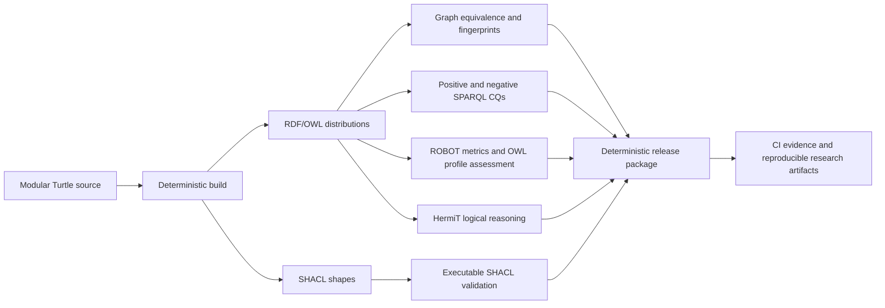

# CM-PharmE

**CM-PharmE** is an evolving, versioned, ontology-grounded conceptual model and research knowledge base for the pharmaceutical ecosystem. The repository is designed as a long-lived research asset supporting conceptual modeling, formal ontology engineering, evaluation, data mapping, publication traceability, reproducible builds, semantic-query testing and future data/application layers.

> **Current stable semantic baseline:** `v1.0.0`  
> Engineering, evaluation or manuscript revisions do **not** automatically create a new semantic model version. A new CM-PharmE release is declared only when semantic changes are explicitly identified, evaluated and versioned.

The latest repository-engineering closure is now integrated into `main`. It preserves the `v1.0.0` semantic baseline while substantially strengthening reproducibility, formal validation, serialization coverage, executable regression testing and research-artifact traceability.

## Start Here

For the shortest research path:

**[Published paper](https://ieeexplore.ieee.org/abstract/document/11301544/) → [Model](#model-at-a-glance--v100) → [Research method](docs/methodology/research-and-model-development.md) → [Evaluation](docs/evaluations/index.md) → [Semantic engineering](docs/engineering/SEMANTIC_ENGINEERING_COMPLETION.md)**

For ontology/formal-engineering details:

**[Ontology](ontology/README.md) → [Concepts](docs/concepts/index.md) → [Relations](docs/relations/index.md) → [Formats](docs/engineering/FORMATS.md) → [Validation](docs/engineering/VALIDATION.md) → [Build](docs/engineering/BUILD.md)**

For a broader map, see the [Documentation Map](docs/index.md).

## Authors and Affiliations

1. **Araz Saie Arasi**  
   Department of Computer Engineering, Ra.C., Islamic Azad University, Rasht, Iran  
   [ORCID: 0009-0009-6739-5717](https://orcid.org/0009-0009-6739-5717)

2. **Hassan Haghighi**  
   Department of Software and Information Systems, Faculty of Computer Science and Engineering, Shahid Beheshti University, Tehran, Iran  
   [ORCID: 0000-0002-6145-4095](https://orcid.org/0000-0002-6145-4095)

3. **Hossein Azgomi**  
   Department of Computer Engineering, Ra.C., Islamic Azad University, Rasht, Iran  
   [ORCID: 0000-0001-7974-1845](https://orcid.org/0000-0001-7974-1845)

## Why CM-PharmE?

Pharmaceutical ecosystems combine enterprises, regulators, healthcare actors, collaborative arrangements, operational and clinical processes, governance constraints and digital infrastructures. Existing ontology, architecture, process, supply-chain and digital-health contributions provide valuable but often separated views of these concerns. CM-PharmE addresses this ecosystem-level semantic fragmentation through a shared conceptual structure with explicit ontological commitments and cross-domain dependencies.

The repository follows an artifact-oriented narrative rather than reproducing manuscript sections:

**Problem → Research gap → CM-PharmE response → Design method → Evidence → Formalization → Evaluation → Reproducibility → Applications → Limitations → Evolution**

[Research rationale](docs/research/rationale.md)

## Design Logic

CM-PharmE uses a two-stage modeling logic derived from the associated research:

1. **Business-architecture concerns identify what requires representation** — organization design, capabilities, stakeholder participation, value delivery, strategy, processes, governance and digital enablement.
2. **UFO/OntoUML clarifies the ontological meaning of the selected constructs** — identity, dependence, roles, relators, modes, temporally unfolding activities, relation semantics and participation constraints.

The model-development lineage combines PRISMA-guided evidence review, thematic synthesis, evidence-to-domain decomposition, business-architecture-informed conceptualization and UFO/OntoUML classification/relation-selection procedures.

[Research and model-development method](docs/methodology/research-and-model-development.md) · [Official OntoUML ecosystem references](docs/references/ontouml-ecosystem.md)

## Repository at a Glance

| Dimension | Current state |
|---|---|
| Stable semantic release | **v1.0.0** |
| Canonical concepts | **39** |
| Stable relation records | **40** — 39 OWL object properties + 1 explicit generalization |
| Modeling domains | **5** |
| OWL qualified cardinality restrictions | **42** |
| Canonical formal graph | **1,086 triples** |
| SHACL graph | **574 triples** |
| SHACL shapes | **76 NodeShapes + 76 PropertyShapes** |
| Positive executable competency queries | **8/8 PASS** |
| Negative regression competency queries | **4/4 PASS** |
| Structural/reference checks | **28/28 PASS** |
| Logical reasoning | **ROBOT + HermiT PASS** for the current axiom set |
| Deterministic build | **Two independent builds required to be byte-identical** |
| Generated distribution/context artifacts | **11** plus SHACL and validation evidence |
| Current semantic version impact of engineering work | **None — v1.0.0 remains stable** |

## Model at a Glance — v1.0.0

| Item | Count |
|---|---:|
| Canonical concepts | **39** |
| Canonical semantic relations | **40** |
| Architectural domains | **5** |
| Concept stereotype families | **5** |
| Relation categories | **6** |

Concept stereotypes: 13 `kind`, 8 `mode`, 7 `role`, 6 `relator`, and 5 `perdurant`.

## Model Snapshot — v1.0.0

[Domains of CM-PharmE v1.0.0](releases/v1.0.0/model/Domains-of-CM-PharmE-1.0.png)

## Five Modeling Domains

1. Organizational / Structural
2. Ecosystem / Collaborative
3. Operational / Process
4. Governance / Regulatory
5. Digital Transformation

These are conceptual modeling domains, not predefined DDD bounded contexts, services or microservices.

## Formal Ontology and Semantic Engineering

The historical OWL export bundled with `v1.0.0` is preserved unchanged for provenance but is not the cleaned canonical ontology source. The authoritative formal source is the modular Turtle under [`ontology/source/modules/`](ontology/source/modules/).

The repository-engineering progression now includes formal ontology engineering, layered evaluation, executable logical validation, deterministic build/CI, extended ontology distributions and reproducible semantic packaging.

Current engineering capabilities include:

- reconstruction of the complete **1,086-triple canonical graph** from modular source;
- deterministic generation of Turtle, OWL/RDF-XML, RDF/XML, expanded JSON-LD, compacted JSON-LD, JSON-LD context, N-Triples, TriG and N-Quads;
- generation of **Manchester Syntax** and **OWL Functional Syntax** through ROBOT/OWLAPI;
- graph-equivalence checking across RDF-compatible formats;
- guarded OWL axiom-level comparison for formal syntax views;
- generation of the **574-triple SHACL graph** with **76 NodeShapes and 76 PropertyShapes**;
- executable SHACL validation over the machine-readable vaccine scenario;
- eight positive competency-query regressions plus four negative absence regressions;
- ROBOT ontology metrics and explicit OWL 2 DL profile assessment;
- ROBOT/HermiT logical reasoning;
- dual-build byte-reproducibility checks;
- deterministic release ZIP generation with SHA-256 integrity evidence;
- explicit separation between generated artifacts and authoritative authoring source.

Canonical graph fingerprint:

`cc823a8aff4d7e7818f8470f2dbad6ca8045ff92e5637fbf3503bc105170a83f`

[Semantic engineering completion](docs/engineering/SEMANTIC_ENGINEERING_COMPLETION.md) · [Formats](docs/engineering/FORMATS.md) · [Validation architecture](docs/engineering/VALIDATION.md) · [Reproducible build](docs/engineering/BUILD.md)

### Validation pipeline

## Evidence and Evaluation

The associated research evaluates CM-PharmE through complementary procedures rather than a single aggregate score. The repository organizes this as a **nine-layer evaluation framework**: Syntax Validation (E1), Logical Consistency (E2), Structural Integrity (E3), Ontological Soundness (E4), Semantic & Expert Validation (E5), Data & Mapping Validation (E6), Competency Questions (E7), Application Validation (E8), and Reproducibility (E9).

Current repository evidence includes:

- **28/28** structural and traceability checks;
- **8/8** positive executable competency queries meeting their bounded expectations;
- **4/4** negative competency regressions returning the expected empty result sets;
- a machine-readable vaccine scenario spanning all five domains;
- executed SHACL validation with a registered and reproducible finding profile;
- anti-pattern re-evaluation and explicit semantic finding disposition;
- ROBOT ontology metrics and explicit profile assessment;
- ROBOT/HermiT logical validation for the current logical axiom set;
- graph-fingerprint, serialization-equivalence, dual-build and deterministic-package gates.

The full generated SHACL constraint set currently reproduces **three registered findings** in the illustrative vaccine scenario: **two Violations and one Warning**. These findings are preserved as explicit evidence rather than hidden by changing the model or sample only to make validation appear fully conformant.

Open semantic findings also remain explicit: three model-refinement candidates and one item deferred pending stronger domain evidence. They are inputs for a future semantic-evolution cycle, not silent changes to the stable `v1.0.0` baseline.

[Final evaluation report](docs/evaluations/b4-final-evaluation.md) · [Release readiness](docs/engineering/release-readiness.md)

## Formal Validation Boundary

The current v1 canonical RDF source is explicitly assessed against the OWL 2 DL profile rather than being described as profile-conformant without evidence. The current source is **not claimed to be fully OWL 2 DL-profile conformant** in its present serialization; the profile assessment records formalization-hygiene findings involving declaration/signature treatment. This is distinct from logical inconsistency: **HermiT completes successfully for the current axiom set**.

Likewise, SHACL execution, competency-query success, logical consistency and deterministic builds provide different kinds of evidence. None of them alone establishes universal domain completeness, empirical effectiveness, standards conformance or correctness of every ontological commitment.

This explicit evidence boundary is part of the repository's reproducibility policy.

## Explore CM-PharmE

| Area | Purpose |
|---|---|
| [Documentation Map](docs/index.md) | Reader-oriented map of the repository and recommended paths |
| [Concepts](docs/concepts/index.md) | Stable concepts, stereotypes, domains and relation traceability |
| [Relations](docs/relations/index.md) | Stable relation registry and semantic endpoints |
| [Domains](docs/domains/index.md) | Five-domain architecture and mappings |
| [Ontology](ontology/README.md) | Formal source, inventory, distributions, IRI policy and validation |
| [Formats](docs/engineering/FORMATS.md) | Supported ontology/data serializations and equivalence policy |
| [Validation](docs/engineering/VALIDATION.md) | Layered structural, SHACL, CQ, profile and logical validation architecture |
| [Build](docs/engineering/BUILD.md) | Deterministic build and reproducibility contract |
| [Semantic Engineering Closure](docs/engineering/SEMANTIC_ENGINEERING_COMPLETION.md) | Latest integrated engineering state and preserved formal findings |
| [Mappings](mappings/README.md) | Concept/domain/relation/data/publication traceability |
| [Evaluation](docs/evaluations/index.md) | Nine-layer evaluation evidence and executable validation |
| [Methodology](docs/methodology/index.md) | Evidence synthesis, modeling and evaluation methods |
| [Engineering](docs/engineering/index.md) | Build, CI, validation and release-readiness architecture |
| [Research Rationale](docs/research/rationale.md) | Problem, gap, significance and boundaries |
| [Applications & Boundaries](docs/research/applications-and-boundaries.md) | Intended application pathways and non-claims |
| [Publications](publications/README.md) | Publication lineage, publisher links and model/evidence association |
| [Versions](docs/versions/index.md) | Stable semantic baseline and integrated engineering/evaluation history |
| [Contribution Guide](CONTRIBUTING.md) | Semantic-source, generated-artifact and evidence-discipline rules |

## Applications and Boundaries

CM-PharmE may support ecosystem/governance reasoning, requirements engineering, interoperability-oriented analysis, reference-architecture interpretation, standards-specific semantic mapping, knowledge-graph development, DDD/software-architecture analysis, dataset mapping and future relational-database/application implementations.

These are application pathways rather than claims of deployed effectiveness. CM-PharmE does not by itself establish legal compliance, FHIR/IDMP/BACM conformance, implementation feasibility, migration cost or organizational adoption.

## Featured Publications

- **CM-PharmE ver.1: Towards a Conceptual Model for Pharmaceutical Ecosystem with a Business-Architecture Perspective** — published conference paper associated with the historical `v1.0.0` conceptual foundation. [IEEE Xplore](https://ieeexplore.ieee.org/abstract/document/11301544/) · [Repository record](publications/ieee-2025/README.md)
- **CM-PharmE 1.0: A Business-Architecture-Informed and Ontology-Grounded Conceptual Model for Pharmaceutical Ecosystems** — journal manuscript **under review**, strengthening methodology, traceability and bounded multi-layer evaluation while retaining the five-domain architecture. [Repository record](publications/journal-under-review/README.md)

Publication status, DOI, publisher links and bibliographic identifiers are recorded only when supported or verified.

## Release and Traceability Model

Released semantic entities are not hard-deleted from history. Concepts, relations and domains use stable identifiers and explicit lifecycle states. Frozen release snapshots preserve semantic inventories and source artifacts.

- [v1.0.0](docs/versions/v1.0.0.md)
- [Versioning policy](docs/policies/versioning.md)
- [Lifecycle policy](docs/policies/lifecycle.md)
- [Semantic changelog](CHANGELOG.md)
- [Migration inventory](MIGRATION_INVENTORY.md)
- [Release readiness](docs/engineering/release-readiness.md)

The planned namespace is `https://w3id.org/cm-pharme/`, but the external `w3id.org` redirect is not yet registered. License selection also remains an explicit repository-owner governance decision.

## Citation

A machine-readable citation record is provided in [`CITATION.cff`](CITATION.cff). Publications should cite the specific CM-PharmE semantic release used in the research whenever possible.

## Repository Status

The completed repository-modernization and semantic-engineering cycle now covers historical preservation, repository foundation, knowledge-model normalization, formal ontology engineering, multi-layer evaluation, executable SHACL and competency-query validation, logical reasoning, expanded semantic formats, deterministic build/CI and reproducible release packaging.

The stable semantic baseline remains `v1.0.0`. Future semantic refinement, independent datasets, ontology-to-relational mapping, knowledge-graph/application layers, persistent IRI deployment and any next-generation CM-PharmE release belong to intentionally governed future research/evolution cycles rather than being implied by repository engineering alone.
