# CM-PharmE 2.0 Visual Ontology Package

Status: V2 human-review artifact.  
Scope: 17 canonical domains.  
Source: Gate-D 87-element conceptual model plus the approved V2 concept-label normalization.  
Boundary: visual review aid only; stable V2 IRIs and formal semantics remain unchanged.

## 1. Ecosystem Organization
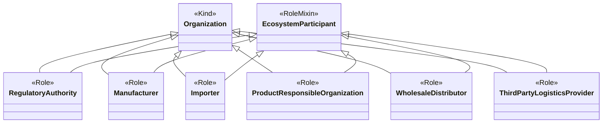

## 2. Facility Operations
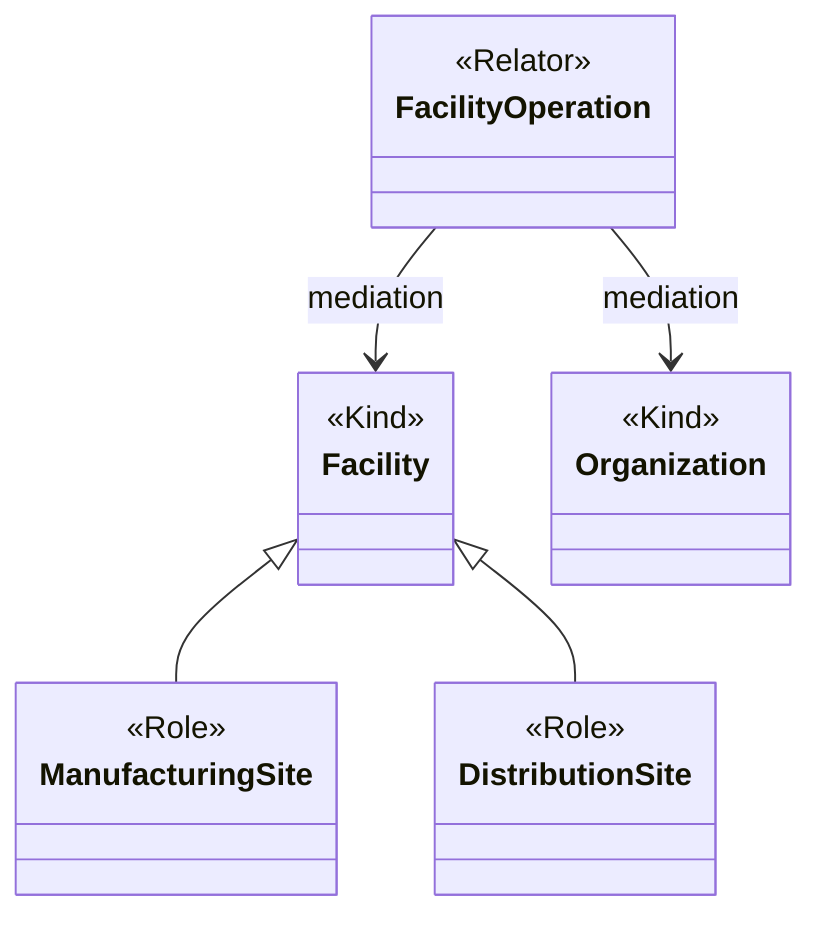

## 3. Regulatory Governance
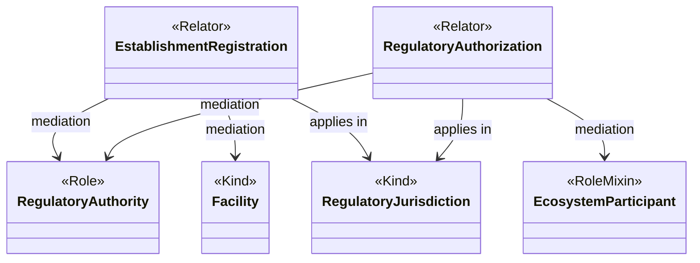

## 4. Pharmaceutical Product
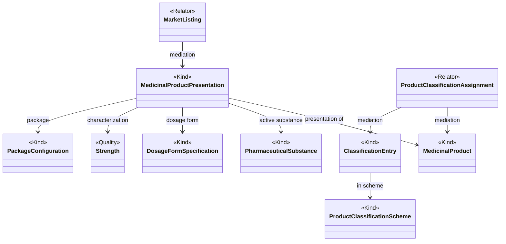

## 5. Supply Operations
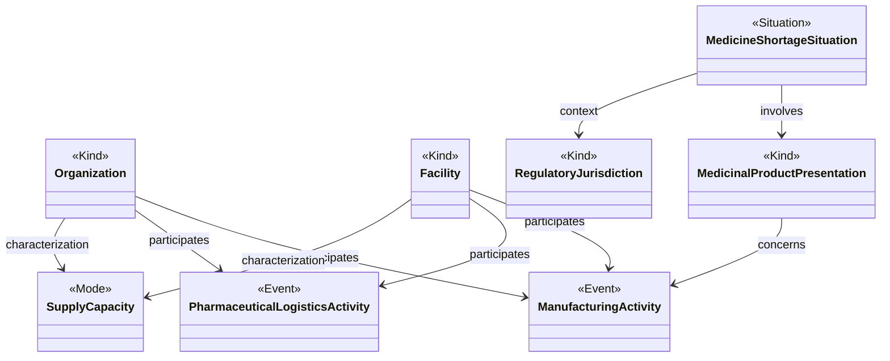

## 6. Ecosystem Observation
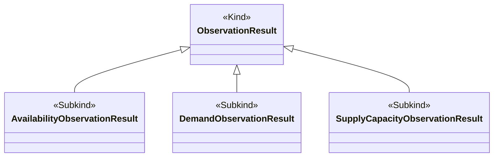

## 7. Spatiotemporal Context
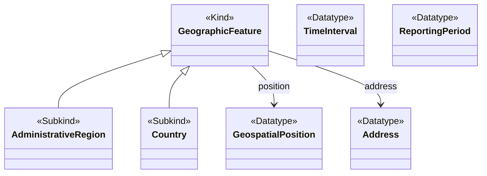

## 8. Evidence Traceability
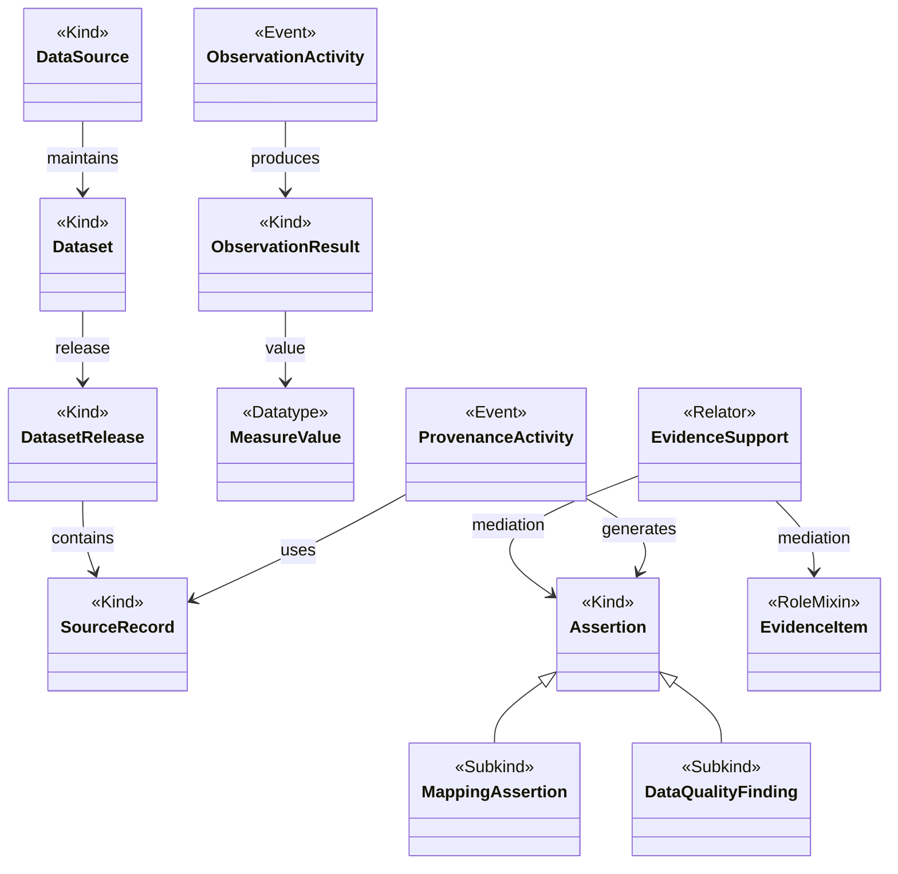

## 9. Entity Identity
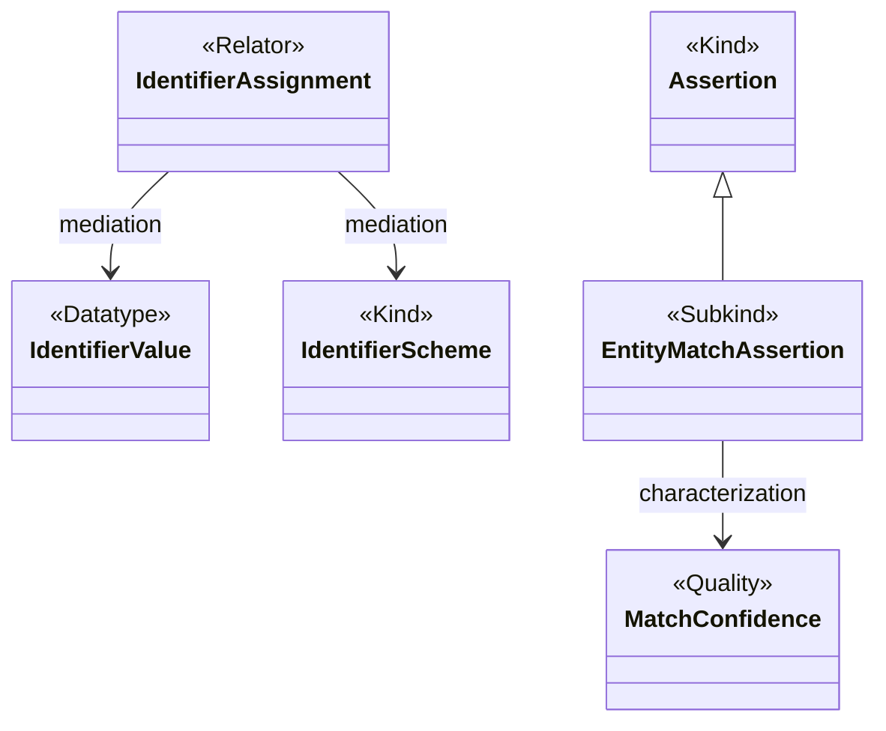

## 10. Regulatory Policy
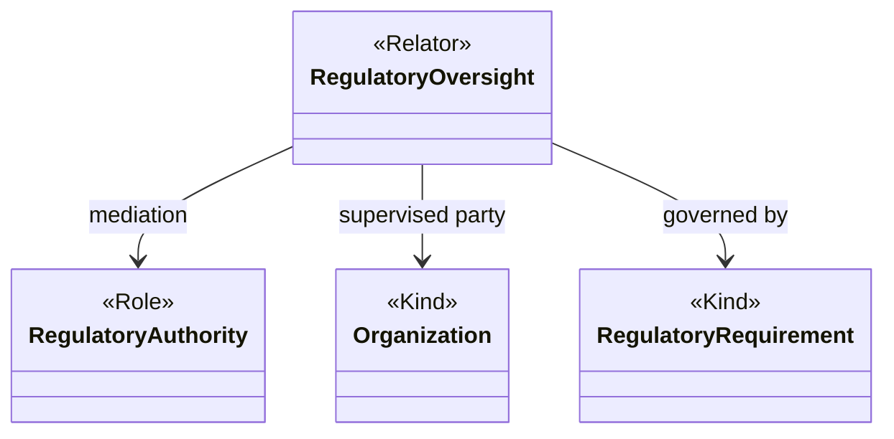

## 11. Supply Resilience
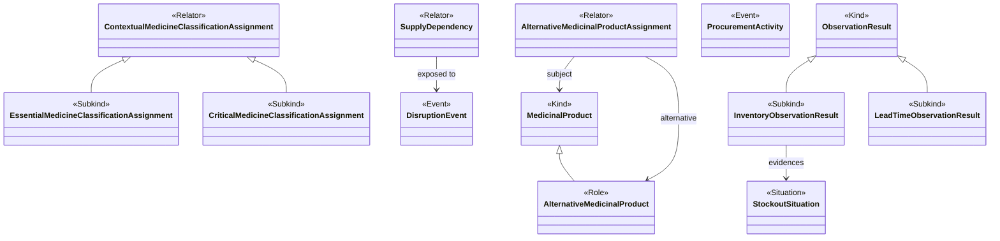

## 12. Market Access
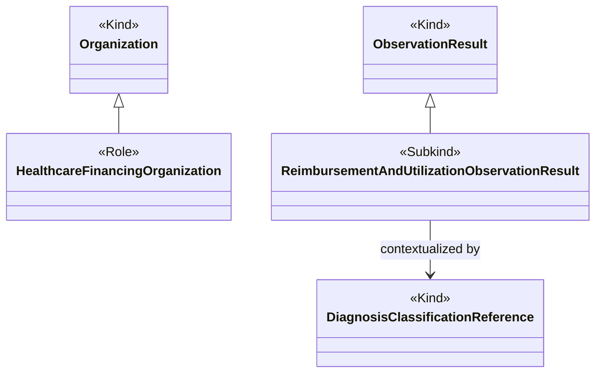

## 13. Risk Management
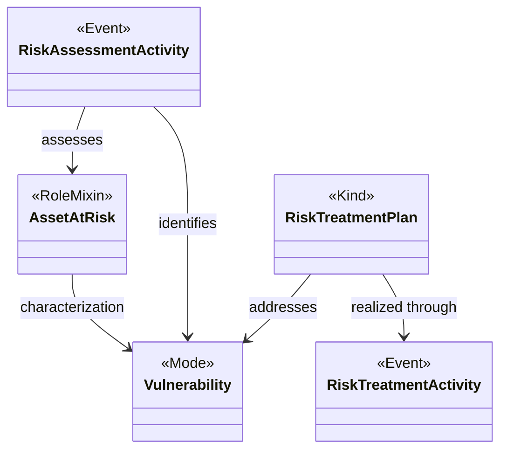

## 14. Pharmacovigilance
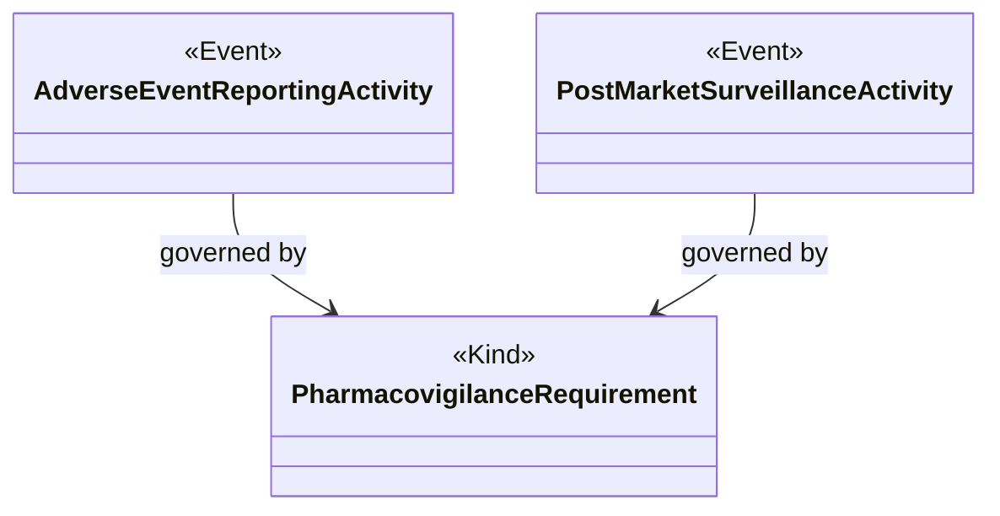

## 15. Business Architecture
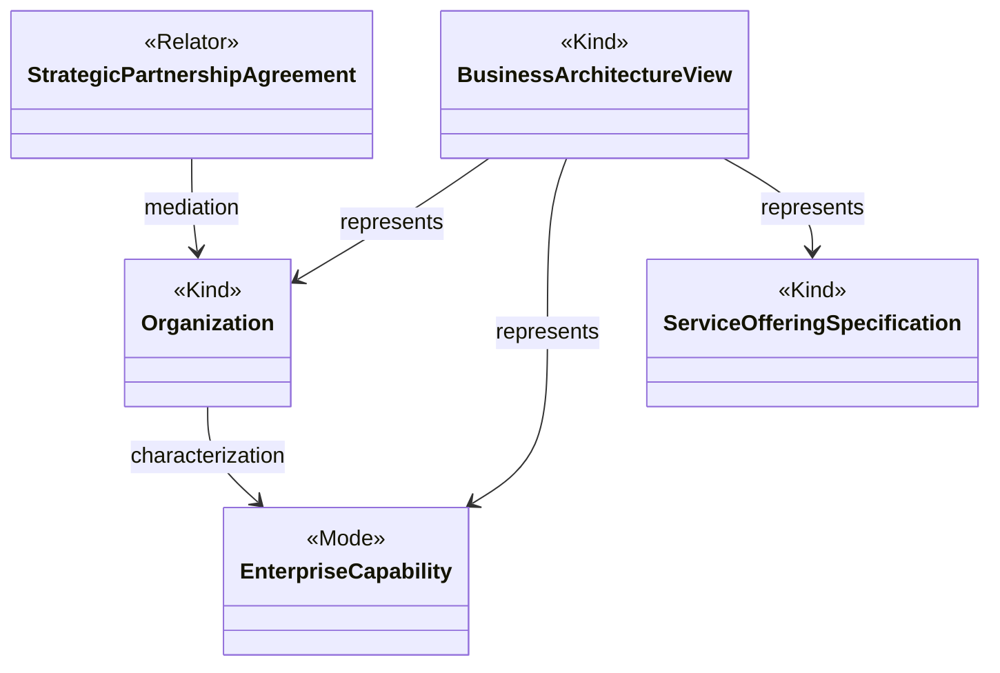

## 16. Digital Systems
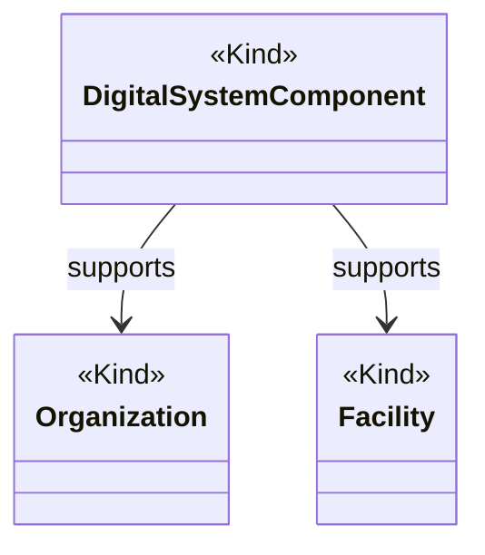

## 17. Clinical Care
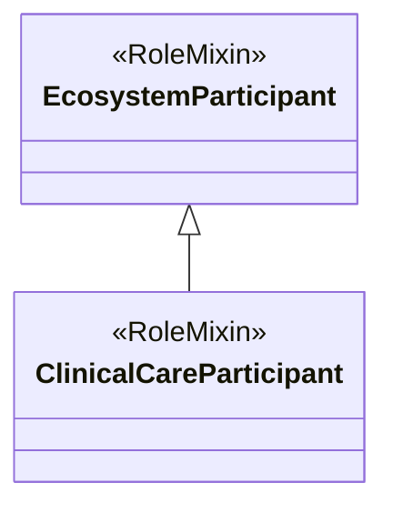

## Review guidance
These diagrams are optimized for human conceptual review rather than exhaustive OWL inspection. Cross-domain relations are repeated only where they clarify the domain. Formal truth remains in the V2 OntoUML specification and OWL/SHACL artifacts. Any diagram-driven semantic change must be recorded as a separate V2 design decision before formalization is changed.
