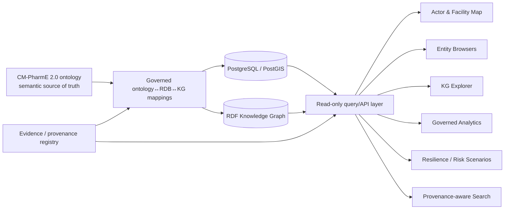

# W8 Global Pharmaceutical Ecosystem Observatory — Article-Scope Design

Issue: #143 / V2-076
Status: design baseline
Gate dependency: Gate F #104 — APPROVE PROGRESSION WITH BOUNDED CLAIM DISPOSITIONS

## 1. Mission and scientific boundary

The Global Pharmaceutical Ecosystem Observatory is a provenance-aware research demonstrator that consumes the validated CM-PharmE 2.0 ontology, ontology-aligned PostgreSQL/PostGIS representation, and provenance-aware RDF knowledge graph to expose selected pharmaceutical-ecosystem structures and queries. Its article role is to demonstrate that the semantic infrastructure is consumable for bounded ecosystem-analysis tasks; it is not a claim of a complete commercial intelligence platform, global transaction reconstruction, clinical decision support, predictive resilience, or autonomous AI.

The ontology/research artifacts remain the semantic source of truth. UI, API, query, analytics, geospatial and search components are derived consumers and must not introduce new ontology identity by implementation convenience.

## 2. Intended article-scope users

The demonstrator is designed for four bounded analytical perspectives:

1. ontology/research reviewer — inspect concepts, relations, provenance and traceability behind a result;
2. pharmaceutical ecosystem analyst — inspect admitted actors, facilities, products and selected relations supported by loaded evidence;
3. resilience/risk analyst — execute the already admitted controlled resilience scenarios and inspect their provenance, without predictive-effectiveness claims;
4. data/semantic engineer — compare ontology, RDB and KG realization for selected registered mappings and benchmark queries.

These are analytical perspectives, not claims of validated personas or production product-market fit.

## 3. Capability map

### C1 — Actor and facility map
- display admitted organization/facility entities with available geospatial representation;
- filter by governed semantic type and provenance;
- show source lineage for displayed locations;
- support representability and query-mechanics claims only.

### C2 — Entity browsers
- browse Drug/Product, Organization/Actor, Facility and admitted relationship views;
- expose stable ontology identifiers and source-backed instance provenance;
- distinguish semantic type from source label/code.

### C3 — Knowledge-graph exploration
- navigate selected ontology/KG relations;
- expose direction, type and provenance;
- provide bounded SPARQL-backed views over the frozen W6 representation.

### C4 — Ecosystem analytics
- expose only analytics with an admitted evidence contract;
- initial scientific baseline is the previously evaluated AN-08 task and the four frozen SQL/SPARQL benchmark pairs where relevant;
- do not generalize evaluated-task success to arbitrary analytics.

### C5 — Resilience and risk view
- expose the frozen controlled resilience scenarios as scenario-level representational demonstrations;
- show assumptions, input evidence and derived output provenance;
- do not claim causal prediction, operational risk forecasting or intervention effectiveness.

### C6 — Provenance-aware semantic search
- allow constrained search over admitted semantic entities and evidence;
- show source/provenance with every result;
- any AI-assisted layer must remain optional, task-bounded and visibly separated from deterministic retrieval.

## 4. Architecture

Architectural invariants:
- no UI-owned semantic identity;
- no source-schema copying into ontology identity;
- write operations are outside the article demonstrator unless separately authorized;
- every displayed analytical/query result must expose provenance or an explicit no-provenance state;
- application-specific convenience structures remain implementation artifacts, not ontology classes by default.

## 5. Representative article tasks

| Task | Demonstrator behavior | Evidence/claim boundary | Evaluation handoff |
|---|---|---|---|
| T01 Ecosystem entity lookup | find an admitted entity, semantic type and source lineage | structural/provenance utility only | V2-083 correctness + provenance visibility |
| T02 Facility geospatial query | retrieve/display admitted facilities under a bounded spatial predicate | supports representability/query mechanics; C-08 effectiveness remains deferred | V2-083 query correctness, latency recorded descriptively, usability task evidence |
| T03 Relation traversal | traverse selected actor/product/facility relations in KG | registered mapping/graph realization only; no global completeness | V2-083 expected-result fixture |
| T04 SQL↔SPARQL paired question | execute one of the four frozen benchmark pairs and compare normalized answers | C-31 only for frozen pairs | regression against W7/W6 benchmark baseline |
| T05 Governed analytic | execute AN-08 with visible source lineage | C-06 selected evaluated task only | deterministic expected output + provenance check |
| T06 Resilience scenario | run/display one frozen resilience scenario with assumptions and evidence | C-09 scenario-level representational adequacy only | reproduce frozen scenario result; no predictive claim |
| T07 Entity-match inspection | inspect candidate match evidence/confidence and provenance | C-32 representation/audit mechanics only; no precision/recall claim | auditability task, not accuracy benchmark |
| T08 Provenance-aware search | retrieve an entity/fact and inspect the evidence path | retrieval utility only | result correctness + provenance completeness |

## 6. Provenance visibility requirements

Every task result must expose, where applicable:
- canonical semantic identifier/type;
- source dataset/artifact identity;
- source record/reference or bounded source locator;
- transformation/mapping identity;
- derivation status: direct / derived / aggregate / scenario / matched;
- confidence or match evidence when an entity-resolution construct is shown;
- limitation flag when evidence is partial, source-specific or held-out.

The UI must never silently convert absence of provenance into evidence of absence.

## 7. Geospatial boundary

PostgreSQL/PostGIS can support selected spatial representation and query mechanics. W8 may demonstrate spatial filtering, map rendering and provenance-linked facility location. It may not infer geospatial usability/effectiveness from successful rendering alone. C-08 remains deferred until V2-083 executes representative tasks with predefined success criteria.

## 8. Entity-resolution boundary

The demonstrator may expose registered entity-match structures, match evidence and confidence where they already exist in W6 infrastructure. It must preserve ambiguity and conflicting evidence. No real-world precision, recall, F1 or superiority claim is admissible without a separately frozen labeled evaluation dataset and protocol. C-32 remains deferred for accuracy performance.

## 9. AI/search boundary

AI assistance is optional and subordinate to deterministic semantic retrieval. Any prototype must:
- operate on a frozen task and supplied semantic/evidence context;
- expose retrieved evidence/provenance;
- clearly distinguish generated explanation from repository facts;
- avoid autonomous ontology mutation;
- avoid novelty/performance claims without a separate baseline, dataset, metric and evaluation protocol.

## 10. Product boundary

Article demonstrator scope includes only the capabilities needed to execute T01–T08 and produce inspectable evaluation evidence. The following are future product/commercial candidates, not W8 article requirements: multi-tenant operations, authentication/authorization productization, alert subscriptions, continuous commercial feeds, enterprise workflows, predictive risk engines, portfolio management, SLA/observability hardening, monetization and customer administration.

## 11. Handoff to W8 work items

- V2-077: implement actor/facility map required for T01/T02.
- V2-078: implement entity browsers required for T01/T03.
- V2-079: implement KG exploration required for T03/T04.
- V2-080: implement bounded analytics required for T04/T05.
- V2-081: implement resilience/risk view required for T06.
- V2-082: prototype provenance-aware semantic/search assistance required for T07/T08, with AI optional.
- V2-083: execute representative-task evaluation across T01–T08 and determine Gate G claim admissibility.

## 12. Gate-G prerequisites

Gate G may be considered only when:
1. all article-scope capabilities used by T01–T08 are reproducibly runnable;
2. expected-result/provenance fixtures exist for deterministic tasks;
3. geospatial effectiveness is supported only by actual W8 task evidence;
4. entity-resolution accuracy is either separately evaluated or explicitly remains unclaimed;
5. unsupported AI performance/novelty claims remain absent;
6. ontology/RDB/KG semantic-source boundaries remain intact;
7. representative-task evidence is traceable into the manuscript claim ledger.

## Claim boundary

This design establishes an application architecture and evaluation contract. It is not application-effectiveness evidence. Gate F boundaries remain authoritative: E9 remains incomplete, C-08 and C-32 performance claims remain deferred, C-06 is limited to selected evaluated tasks, and C-09 remains scenario-level rather than predictive/causal.