# CM-PharmE 2.0 — Whole-Ontology Simple View

This is the complete **87-concept / 17-domain** GitHub human-review view. It uses the approved simple Mermaid convention: one plain-text box per concept, OntoUML stereotype + concept name, no HTML tags, and no class attribute/operation compartments.

**Boundary:** the concept inventory is complete for the current Gate-D baseline. The relation overlay below is intentionally review-oriented and emphasizes principal inheritance, mediation, evidence, observation and cross-domain links. The authoritative relation/axiom semantics remain in the integrated OntoUML and OWL artifacts.

```mermaid
flowchart TB

subgraph D1["1. Ecosystem Organization"]
ORG["«Kind»
Organization"]
EP["«RoleMixin»
Ecosystem Participant"]
RA["«Role»
Regulatory Authority"]
MAN["«Role»
Manufacturer"]
IMP["«Role»
Importer"]
PRO["«Role»
Product Responsible Organization"]
WD["«Role»
Wholesale Distributor"]
TPL["«Role»
Third-Party Logistics Provider"]
end

subgraph D2["2. Facility Operations"]
FAC["«Kind»
Facility"]
MS["«Role»
Manufacturing Site"]
DS["«Role»
Distribution Site"]
FOP["«Relator»
Facility Operation"]
end

subgraph D3["3. Regulatory Governance"]
ER["«Relator»
Establishment Registration"]
AUTH["«Relator»
Regulatory Authorization"]
RJ["«Kind»
Regulatory Jurisdiction"]
end

subgraph D4["4. Pharmaceutical Product"]
MP["«Kind»
Medicinal Product"]
PS["«Kind»
Pharmaceutical Substance"]
MPP["«Kind»
Medicinal Product Presentation"]
DFS["«Kind»
Dosage Form Specification"]
STR["«Quality»
Strength"]
PKG["«Kind»
Package Configuration"]
PCS["«Kind»
Product Classification Scheme"]
CE["«Kind»
Classification Entry"]
PCA["«Relator»
Product Classification Assignment"]
ML["«Relator»
Market Listing"]
end

subgraph D5["5. Supply Operations"]
MA["«Event»
Manufacturing Activity"]
PLA["«Event»
Pharmaceutical Logistics Activity"]
MSS["«Situation»
Medicine Shortage Situation"]
SC["«Mode»
Supply Capacity"]
end

subgraph D6["6. Ecosystem Observation"]
AOR["«Subkind»
Availability Observation Result"]
DOR["«Subkind»
Demand Observation Result"]
SCOR["«Subkind»
Supply Capacity Observation Result"]
end

subgraph D7["7. Spatiotemporal Context"]
GF["«Kind»
Geographic Feature"]
AR["«Subkind»
Administrative Region"]
CO["«Subkind»
Country"]
GP["«Datatype»
Geospatial Position"]
ADR["«Datatype»
Address"]
TI["«Datatype»
Time Interval"]
RP["«Datatype»
Reporting Period"]
end

subgraph D8["8. Evidence Traceability"]
SRC["«Kind»
Data Source"]
DATA["«Kind»
Dataset"]
DR["«Kind»
Dataset Release"]
SR["«Kind»
Source Record"]
AS["«Kind»
Assertion"]
OA["«Event»
Observation Activity"]
OR["«Kind»
Observation Result"]
MV["«Datatype»
Measure Value"]
EI["«RoleMixin»
Evidence Item"]
ES["«Relator»
Evidence Support"]
MAPA["«Subkind»
Mapping Assertion"]
PA["«Event»
Provenance Activity"]
DQF["«Subkind»
Data Quality Finding"]
end

subgraph D9["9. Entity Identity"]
IV["«Datatype»
Identifier Value"]
IS["«Kind»
Identifier Scheme"]
IA["«Relator»
Identifier Assignment"]
EMA["«Subkind»
Entity Match Assertion"]
MC["«Quality»
Match Confidence"]
end

subgraph D10["10. Regulatory Policy"]
RR["«Kind»
Regulatory Requirement"]
RO["«Relator»
Regulatory Oversight"]
end

subgraph D11["11. Supply Resilience"]
CMCA["«Relator»
Contextual Medicine Classification Assignment"]
EMCA["«Subkind»
Essential Medicine Classification Assignment"]
CRCA["«Subkind»
Critical Medicine Classification Assignment"]
AMP["«Role»
Alternative Medicinal Product"]
AMPA["«Relator»
Alternative Medicinal Product Assignment"]
SD["«Relator»
Supply Dependency"]
DE["«Event»
Disruption Event"]
IOR["«Subkind»
Inventory Observation Result"]
PROC["«Event»
Procurement Activity"]
LTOR["«Subkind»
Lead Time Observation Result"]
SS["«Situation»
Stockout Situation"]
end

subgraph D12["12. Market Access"]
HFO["«Role»
Healthcare Financing Organization"]
RUOR["«Subkind»
Reimbursement and Utilization Observation Result"]
DCR["«Kind»
Diagnosis Classification Reference"]
end

subgraph D13["13. Risk Management"]
AAR["«RoleMixin»
Asset at Risk"]
RAA["«Event»
Risk Assessment Activity"]
VUL["«Mode»
Vulnerability"]
RTP["«Kind»
Risk Treatment Plan"]
RTA["«Event»
Risk Treatment Activity"]
end

subgraph D14["14. Pharmacovigilance"]
PVR["«Kind»
Pharmacovigilance Requirement"]
AERA["«Event»
Adverse Event Reporting Activity"]
PMSA["«Event»
Post-Market Surveillance Activity"]
end

subgraph D15["15. Business Architecture"]
BAV["«Kind»
Business Architecture View"]
EC["«Mode»
Enterprise Capability"]
SPA["«Relator»
Strategic Partnership Agreement"]
SOS["«Kind»
Service Offering Specification"]
end

subgraph D16["16. Digital Systems"]
DSC["«Kind»
Digital System Component"]
end

subgraph D17["17. Clinical Care"]
CCP["«RoleMixin»
Clinical Care Participant"]
end

RA -->|specializes| EP
MAN -->|specializes| EP
IMP -->|specializes| EP
PRO -->|specializes| EP
WD -->|specializes| EP
TPL -->|specializes| EP
RA -->|role of| ORG
MAN -->|role of| ORG
IMP -->|role of| ORG
PRO -->|role of| ORG
WD -->|role of| ORG
TPL -->|role of| ORG

MS -->|role of| FAC
DS -->|role of| FAC
FOP -->|mediates| ORG
FOP -->|mediates| FAC

ER -->|registered organization| ORG
ER -->|registered facility| FAC
ER -->|applies in| RJ
AUTH -->|authorized organization| ORG
AUTH -->|issued by| RA
AUTH -->|applies in| RJ

MP -->|has presentation| MPP
MPP -->|contains/uses| PS
MPP -->|dosage form| DFS
MPP -->|strength| STR
MPP -->|package| PKG
PCS -->|contains| CE
PCA -->|classifies| MP
PCA -->|uses entry| CE
ML -->|lists| MPP
ML -->|jurisdiction| RJ

MA -->|performed by| MAN
MA -->|occurs at| MS
PLA -->|performed by| WD
PLA -->|performed by| TPL
MSS -->|involves| MP
MSS -->|jurisdiction| RJ
SC -->|inheres in| FAC

AOR -->|specializes| OR
DOR -->|specializes| OR
SCOR -->|specializes| OR
SCOR -->|observes| SC

AR -->|specializes| GF
CO -->|specializes| GF
GF -->|position| GP
GF -->|address| ADR
FAC -->|located in| GF
RJ -->|contextualized by| GF
OA -->|time| TI
OR -->|reporting period| RP

SRC -->|publishes| DATA
DATA -->|has release| DR
DR -->|contains| SR
OA -->|produces| OR
OR -->|value| MV
MAPA -->|specializes| AS
DQF -->|specializes| AS
ES -->|supports| AS
ES -->|uses evidence| EI
SR -->|can play| EI
PA -->|uses| SR
PA -->|generates| AS

IA -->|uses scheme| IS
IA -->|assigns value| IV
IA -->|identifies| ORG
IA -->|identifies| FAC
IA -->|identifies| MP
EMA -->|specializes| AS
EMA -->|confidence| MC
EMA -->|matches evidence from| SR

RO -->|authority| RA
RO -->|oversees| ORG
RO -->|governed by| RR
RR -->|jurisdiction| RJ

EMCA -->|specializes| CMCA
CRCA -->|specializes| CMCA
CMCA -->|classifies| MP
CMCA -->|jurisdiction| RJ
AMP -->|role of| MP
AMPA -->|assigns alternative| AMP
AMPA -->|for product| MP
SD -->|depends on| ORG
SD -->|depends on| FAC
DE -->|disrupts| SD
IOR -->|specializes| OR
LTOR -->|specializes| OR
IOR -->|evidences| SS
PROC -->|involves| ORG
PROC -->|involves| MP

HFO -->|role of| ORG
RUOR -->|specializes| OR
RUOR -->|contextualized by| DCR
RUOR -->|financing context| HFO

RAA -->|assesses| AAR
RAA -->|identifies| VUL
RTP -->|addresses| VUL
RTP -->|realized through| RTA
AAR -->|may be played by| ORG
AAR -->|may be played by| FAC
AAR -->|may be played by| MP

AERA -->|governed by| PVR
PMSA -->|governed by| PVR
PVR -->|applies to| MP

ORG -->|bears| EC
SPA -->|mediates| ORG
BAV -->|represents| EC
BAV -->|represents| SOS

DSC -->|supports| ORG
DSC -->|supports| FAC

CCP -->|specializes| EP
```

## Review reading guide
- Start by checking whether every major conceptual area of the pharmaceutical ecosystem appears in a reasonable place.
- Then inspect cross-domain relations, especially Organization↔Facility, Product↔Supply, Evidence↔Observation, Geography↔Jurisdiction, and Risk/Resilience extensions.
- Use the 17 domain diagrams for local detail and the Concept Catalog for evidence-level inspection.

## Authoritative links
- [Domain diagrams](../research/w4/visual-ontology-package.md)
- [Integrated OntoUML model](../research/w4/integrated-ontouml-model.md)
- [Concept provenance matrix](../research/w4/human-review-concept-provenance-matrix.md)
- [Concept Catalog](concepts/index.md)
- [Domain Catalog](domains/index.md)
